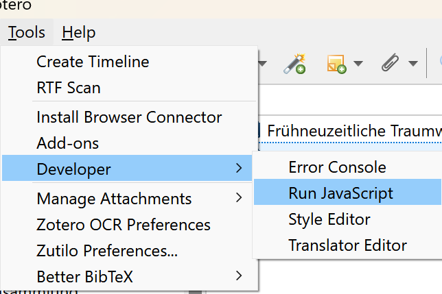

# Zotero-S'n'R Expanded - Search and Replace for Zotero
This is an expanded version of [Schoeneh's](https://github.com/Schoeneh) Zotero search and replace script.

This version supports supports selections, regular expressions, better search handling, and autocomplete suggestions.

## What you should do:
**Back up your local Zotero-library before using my script (or doing any batch-editing)!**
- [Guide by University of Ottawa Library](https://uottawa.libguides.com/how_to_use_zotero/back_up_and_restore)
- [Official Documentation](https://www.zotero.org/support/zotero_data)

## How to use it -- 1: "Run JavaScript"
The easiest way of running Zotero-S'n'R is to copy the code from '[src/basic_script.js](https://github.com/Schoeneh/zotero-s-n-r/releases/latest/download/basic_script.js)' into Tools --> Developer --> Run Javascript:

## How to use it -- 2: Plugin
--- in development ---
