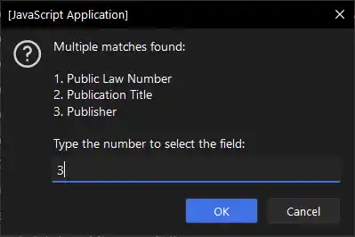
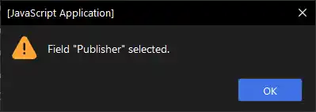
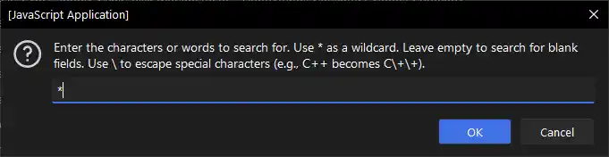
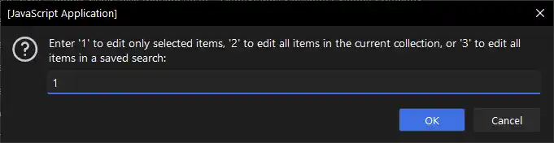
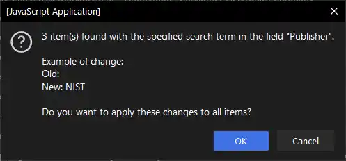
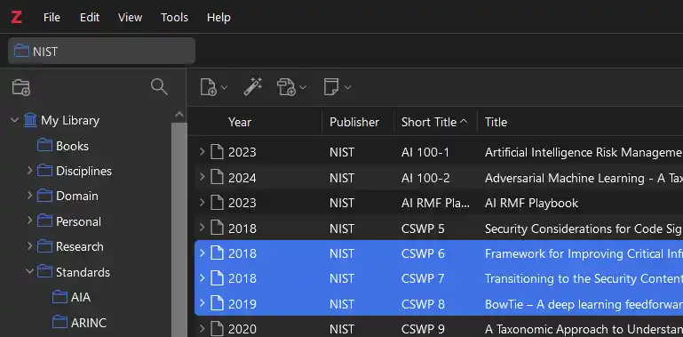

# Zotero Bulk Edit Script

## Overview

This JavaScript script allows users to bulk edit records in Zotero by providing an easy-to-use prompt system to search and replace field values across multiple selected items. It supports a wide range of fields and ensures that the editing process is intuitive and user-friendly.

The script has been tested in Zotero v7.

This project builds on [Schoeneh's](https://github.com/Schoeneh) Zotero Search and Replace script.

## Features

- **Autocomplete Field Selection**: Start typing the name of the field you want to edit, and the script provides a list of matching fields for you to choose from.
- **Regular Expression Search**: Use full regular expressions to search for patterns within field values, allowing for advanced search capabilities.
- **Case-Insensitive Matching**: The search functionality is case-insensitive, making it easier to find the records you want to edit.
- **Preview Changes**: Before applying changes, the script shows a preview of the old and new values for one of the matching records, allowing you to confirm the bulk edit.
- **Bulk Processing**: Edits are applied to all selected items that match the search criteria.

## Back Up

**Be sure to back up your local Zotero library**

- [Guide by University of Ottawa Library](https://uottawa.libguides.com/how_to_use_zotero/back_up_and_restore)
- [Official Documentation](https://www.zotero.org/support/zotero_data)

## Getting Started

1. **Select Items in Zotero**: Begin by selecting the items you want to edit in Zotero.
2. **Run the Script**: Execute the script to start the bulk editing process.
3. **Field Selection**: When prompted, start typing the field name you want to edit. The script will show matching options for you to confirm.
4. **Search and Replace**: Enter the search term using regular expressions for advanced search patterns, and specify the replacement value.
5. **Confirm Changes**: Review the preview of the changes and confirm to apply the edits.

## Example

In this example, we will update the `Publisher` field for a group of selected items:

1. Select the items in Zotero that you wish to edit.

   

2. Open the `Run Javascript` window in Zotero under `Tools > Developer > Run Javascript`.

   

3. This will open a second window in Zotero.

   

4. Copy and paste the [Bulk Edit script](https://github.com/thalient-ai/zotero-bulk-edit/blob/main/src/zotero_bulk_edit.js) into the `Run Javascript` window and select the `Run` button in the top left corner. This will start the JavaScript application.

**You can either access the script [here](https://github.com/thalient-ai/zotero-bulk-edit/blob/main/src/zotero_bulk_edit.js) or by opening the .js file in your chosen text editor.**

   

6. Enter the field that you wish to edit.

**[Here](https://api.zotero.org/itemFields) is a list of supported fields. The script also support First Name & Last Name**

   

8. Your input does not have to be case-sensitive or complete. The application will offer suggestions based on your input.

   
   
   

9. Enter the search term. The script supports regular expressions and can handle blank fields. Because the `Publisher` field we are updating is empty, we will leave this field blank.

   

10. Enter the replacement text.

   
   
11. Choose whether you want to edit selected items, all items in the active collection, or items in the active saved search.

	

11. The script will provide a summary of the changes for review before making them.

   
   
   

11. Here are the results.

   

## Other Considerations

Zotero handles item fields and creator names differently due to their distinct data structures and use cases:

### Item Fields:
- **General Metadata**: Fields like `title`, `abstractNote`, `publisher`, etc., are standard metadata fields applicable to various item types (e.g., books, articles).
- **Single Value**: Each field typically holds a single value.
- **Direct Editing**: Users can directly edit these fields without special handling.

### Creator Names:
- **Complex Structure**: Creator fields (`creatorFirstName`, `creatorLastName`) consist of multiple components (first name, last name, creator type).
- **Multiple Entries**: An item can have multiple creators (authors, editors, etc.).
- **Validation**: Both `firstName` and `lastName` fields need careful handling to avoid empty values, as Zotero enforces non-empty creator names.

### Practical Implications:
- **Item Fields**: Simplified bulk edits with standard search and replace functionality.
- **Creator Names**: Requires transaction management, validation checks, and potential deletion if fields are empty post-editing to maintain data integrity.
