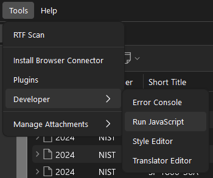
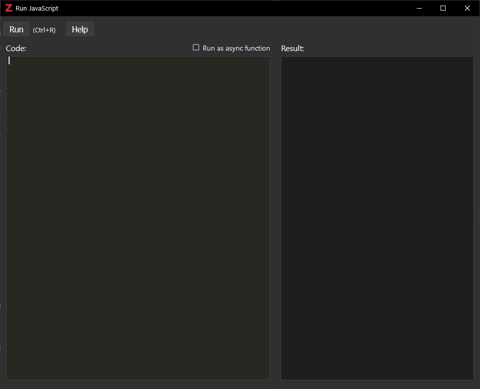
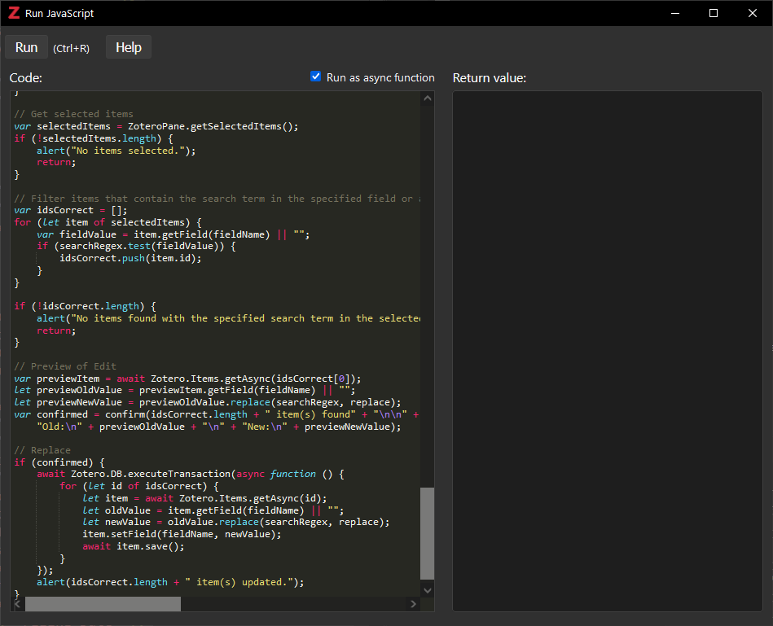

# Zotero Bulk Edit Script

## Overview

This JavaScript script allows users to bulk edit records in Zotero by providing an easy-to-use prompt system to search and replace field values across multiple selected items. It supports a wide range of fields and ensures that the editing process is intuitive and user-friendly.

This project builds from [Schoeneh's](https://github.com/Schoeneh) Zotero Search and Replace script.

### Features

- **Autocomplete Field Selection**: Start typing the name of the field you want to edit, and the script provides a list of matching fields for you to choose from.
- **Regular Expression Search**: Use full regular expressions to search for patterns within field values, allowing for advanced search capabilities.
- **Case-Insensitive Matching**: The search functionality is case-insensitive, making it easier to find the records you want to edit.
- **Preview Changes**: Before applying changes, the script shows a preview of the old and new values for one of the matching records, allowing you to confirm the bulk edit.
- **Bulk Processing**: Edits are applied to all selected items that match the search criteria.

### Getting Started
1. **Select Items in Zotero**: Begin by selecting the items you want to edit in Zotero.
2. **Run the Script**: Execute the script to start the bulk editing process.
3. **Field Selection**: When prompted, start typing the field name you want to edit. The script will show matching options for you to confirm.
4. **Search and Replace**: Enter the search term using regular expressions for advanced search patterns, and specify the replacement value.
5. **Confirm Changes**: Review the preview of the changes and confirm to apply the edits.

### Example

In this example, we will update the `Publisher` field for a group of selected items:

1. **Run Javascript**: Open the `Run Javascript` window in Zotero under Tools > Developer > Run Javascript

2. **Copy the Javascript**: Copy and paste the Bulk Edit script into the `Run Javascript`

4. **Replacement Value**: Enter `new`.
5. **Confirm Changes**: Review the preview and confirm to apply the changes to all matching items.

## Back Up
**Back up your local Zotero-library beforehand!**
- [Guide by University of Ottawa Library](https://uottawa.libguides.com/how_to_use_zotero/back_up_and_restore)
- [Official Documentation](https://www.zotero.org/support/zotero_data)
