# Zotero Attachment Renamer

This script allows you to rename attachments in Zotero using parent item metadata. It offers options to update either the attachment's filename, the attachment title, or both. This is particularly useful for handling large collections where you need to perform bulk or batch renaming of attachments.

## Key Problems Addressed

- **Separate Names for Attachments**: In Zotero, attachments have two separate names: an attachment title and a filename. For more details, see the [Zotero File Renaming documentation](https://www.zotero.org/support/file_renaming).

	

     
Attachment Info Example

     
	 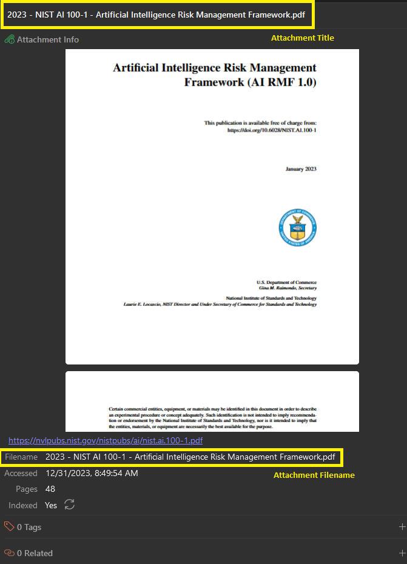

	

	
- **Limitation of Built-in Methods**: The built-in method for updating attachment information from parent metadata can only be executed by selecting and right-clicking on the attachment(s). This is limiting in large collections where bulk or batch renaming is needed.

	

     
Attachment Rename Example

     
	 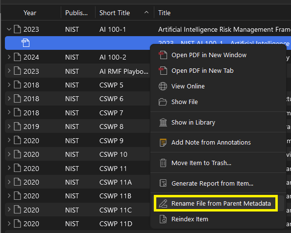

	

## Features

- **Flexible Selection**: You can select either the parent item or child attachment.
- **Multiple Renaming Options**: Choose to update:
  - Selected items
  - All items in the active collection
  - All items in a saved search
- **Customizable Updates**: Options to update:
  - Filename only
  - Attachment title only
  - Both filename and attachment title
  
## Back Up

**Be sure to back up your local Zotero library**

- [Guide by University of Ottawa Library](https://uottawa.libguides.com/how_to_use_zotero/back_up_and_restore)
- [Official Documentation](https://www.zotero.org/support/zotero_data)

## Usage

0. **Define File Renaming Format**:
   - Open the Zotero settings from `Edit` -> `Settings`.
   - In the `General` tab of the `Settings`, go to `Customize Filename Format`.
   - Define your `Filename Template`:
     

     
Filename Format Example

     
	 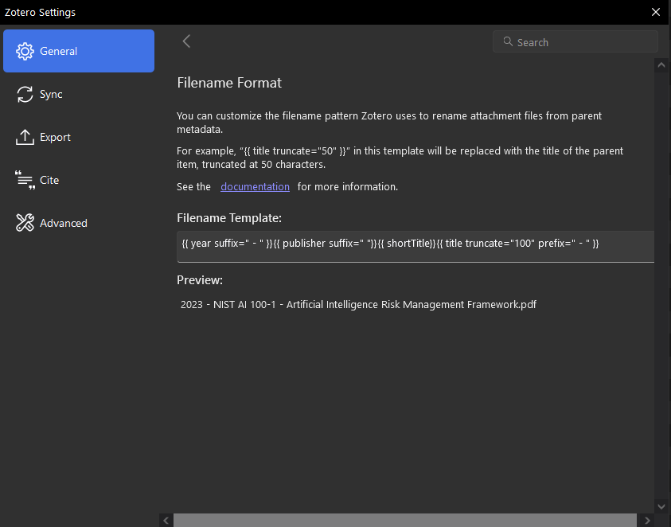

	

1. Download the script file: [zotero-attachment-rename](https://github.com/thalient-ai/zotero-scripts/blob/main/zotero-attachment-rename/src/zotero_attachment_rename.js)

2. Open Zotero and navigate to `Tools -> Developer -> Run JavaScript`.

3. Copy and paste the contents of `duplicate_enhanced.js` into the console and run the script.
   
4. **Select Items**: Choose the items you want to rename.
   - Only selected items
   - All items in the active collection
   - All items in the saved search

5. **Choose Renaming Option**: The script will prompt you to select what you want to update:
   - Filename only
   - Attachment title only
   - Both filename and attachment title

6. **Confirm and Execute**: The script will process the selected items, present a preview, and rename the attachments based on the chosen option upon user confirmation.

7. **Editing many items will take time, a confirmation window will be presented at the completion**

8. If you need to edit multiple attachment filenames or titles, you can use the [Zotero Bulk Edit script](https://github.com/thalient-ai/zotero-bulk-edit). Use the "Title" field option.

## Note

- **Zotero 7 Compatibility**: This script is applicable to Zotero 7, currently in beta. Zotero 7 introduces a new, powerful syntax for customizing filenames. The default format can be customized from the General pane of the Zotero settings.
- **Permissions**: Ensure you have the correct permissions and that the items selected are indeed attachments with files associated with them.
- **Logging**: The script includes detailed logging to help trace the process and identify any potential issues with renaming the files.

## Example

In this example, we will update both the attachment title and filenames for selected items.

0. Define the format for file renaming in the Zotero 7 settings

		

1. Select the items in Zotero whose attachments you wish to rename. You can select the parent items whose child attachments you wish to rename. You do not need to select the attachments directly.

	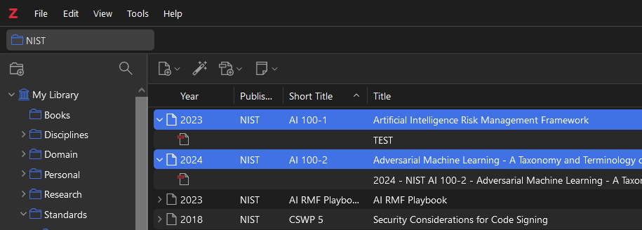
	
2. Open the `Run JavaScript` window in Zotero under `Tools > Developer > Run JavaScript`.

   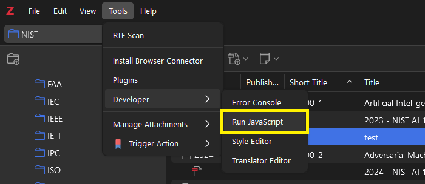

3. This will open a second window in Zotero.

   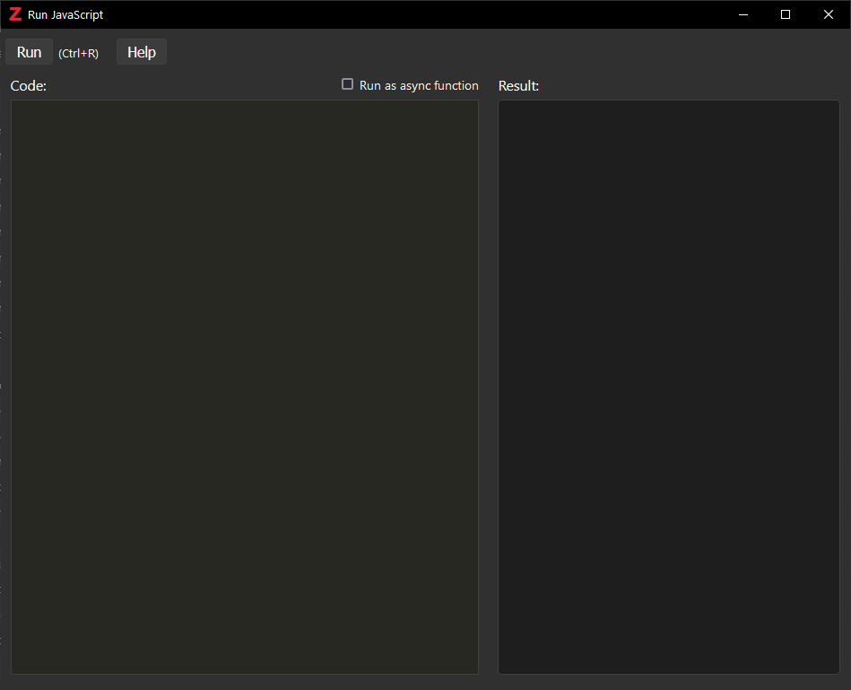

4. Copy and paste the [Attachment Renamer script](https://github.com/thalient-ai/zotero-attachment-rename/blob/main/src/zotero_attachment_rename.js) into the `Run JavaScript` window and select the `Run` button in the top left corner. This will start the JavaScript application. The script can be accessed [here](https://github.com/thalient-ai/zotero-attachment-rename/blob/main/src/zotero_attachment_rename.js) or by opening the .js file in your chosen text editor.

   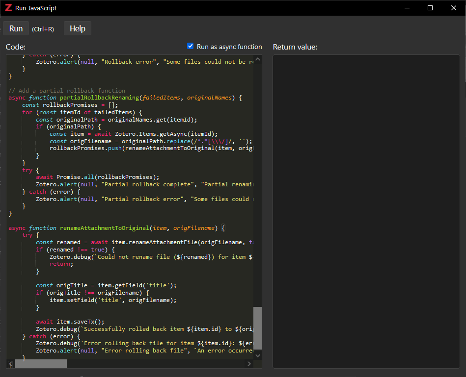

5. Choose whether you want to edit selected items, all items in the active collection, or items in the active saved search.

   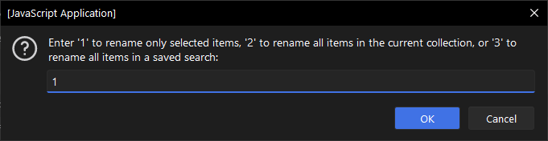
   
6. Choose whether you want to rename the attachment titles, filenames, or both.

   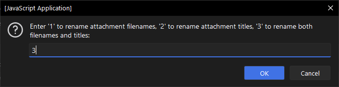
   
7. The script will provide a count of items affected and a summary of the changes for review before making them.

    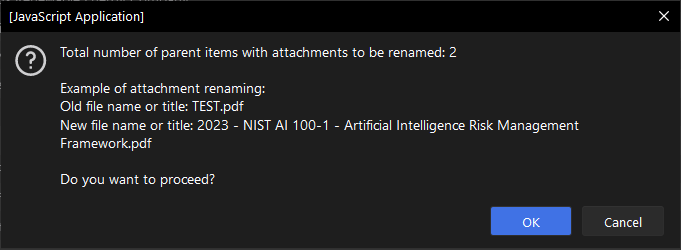
    
    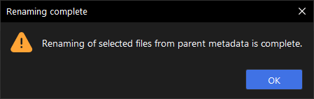
	
	If an item has multiple attachments, you will be prompted to choose which attachments should be renamed.
	
	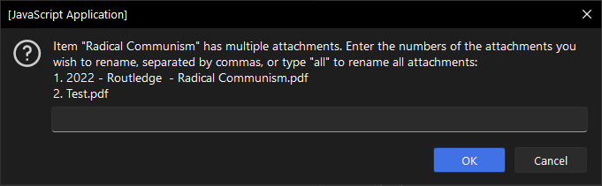
	
7. Here you can see that both the attachment filename and title were updated

    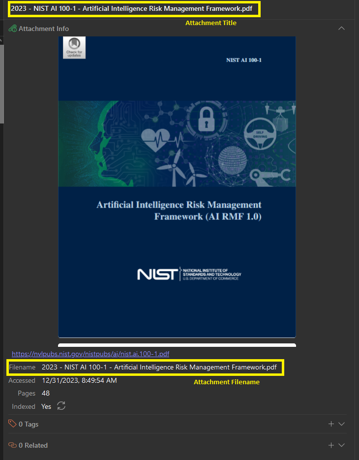

## Contributing

Contributions are welcome! Feel free to open an issue or submit a pull request.
