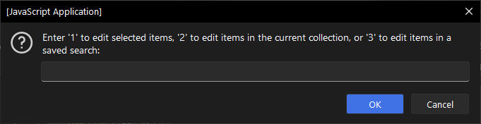
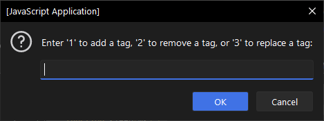
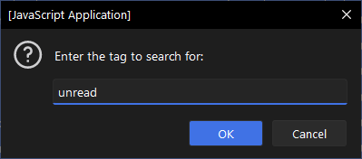
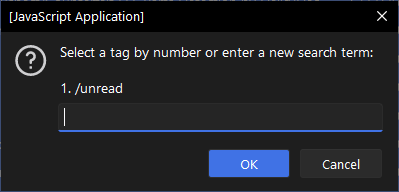
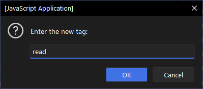
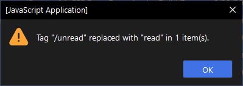

# Zotero Batch Tag Manager

This script helps manage tags within your Zotero library by allowing you to perform bulk operations, such as adding, removing, replacing, splitting, or combining tags across multiple items. This script is designed to handle large collections efficiently while providing detailed feedback and user confirmations.

## Features

- **Add Tags**: Add one or more tags to multiple selected items at once.
- **Remove Tags**: Choose from multiple options to remove specific tags from multiple selected items with a confirmation prompt before execution:
  - Remove a single tag.
  - Remove multiple tags by search.
  - Remove all tags.
  - Remove all tags except specified ones.
- **Replace Tags**: Replace one tag with another across multiple selected items, ensuring only items with the original tag are modified.
- **Split Tags**: Split a tag into multiple tags based on a specified delimiter.
- **Combine Tags**: Combine multiple tags into one new tag.
- **Detailed Logging**: Provides progress feedback and logs detailed actions taken for each item.
- **User Confirmation**: Prompts for confirmation before performing significant operations like removing or replacing tags.

## Installation

1. Clone the repository or [download](https://github.com/thalient-ai/zotero-scripts/blob/main/zotero-batch-tag/src/zotero_batch_tag.js) the script.

2. Open Zotero and navigate to `Tools -> Developer -> Run JavaScript`.

3. Copy and paste the contents of `zotero_batch_tag_manager.js` into the console and run the script.

## Usage

1. **Select Items**:
   - The script prompts you to choose items to process: selected items, items in the current collection, or items from a saved search.
   

2. **Choose Operation**:
   - **Add a Tag**: Prompts for the tag to be added and applies it to the selected items.
   - **Remove Tags**: Prompts for the removal option and then executes the chosen removal action:
     - Remove a single tag.
     - Remove multiple tags by search.
     - Remove all tags.
     - Remove all tags except specified ones.
   - **Replace a Tag**: Prompts for the old tag and the new tag, confirms the action, and replaces the old tag with the new tag in the selected items.
   - **Split a Tag**: Prompts for the tag and the delimiter, then splits the tag into multiple tags.
   - **Combine Tags**: Prompts for the tags to combine and the new combined tag, then combines the specified tags into one.
   

3. **Confirmation and Progress**:
   - For remove and replace operations, the script provides a confirmation prompt with details on the number of items affected.
   - The script logs detailed progress and actions taken for each item.
   

## Example

1. **Adding a Tag**:
   - User selects items to tag.
   - Script prompts for the tag to add.
   - Script adds the specified tag to all selected items and logs the progress.

2. **Removing Tags**:
   - User selects items from which they want to remove tags.
   - Script prompts for the removal option (single tag, multiple tags by search, all tags, or all tags except specified ones).
   - Script confirms the action, removes the tags from all relevant items, and logs the progress.

3. **Replacing a Tag**:
   - User selects items in which they want to replace a tag.
   - Script prompts for the old tag and the new tag.
   - Script confirms the action, replaces the old tag with the new tag in all relevant items, and logs the progress.

4. **Splitting a Tag**:
   - User selects items with the tag to split.
   - Script prompts for the tag and the delimiter.
   - Script splits the tag into multiple tags and logs the progress.

5. **Combining Tags**:
   - User selects items with the tags to combine.
   - Script prompts for the tags to combine and the new combined tag.
   - Script combines the tags into one new tag and logs the progress.

## Compatibility
All scripts were written for Zotero 7

## Contributing

Contributions are welcome! Please feel free to submit a Pull Request or open an issue if you have any suggestions or find any bugs.