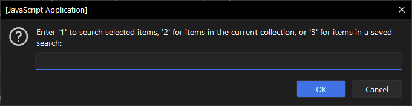
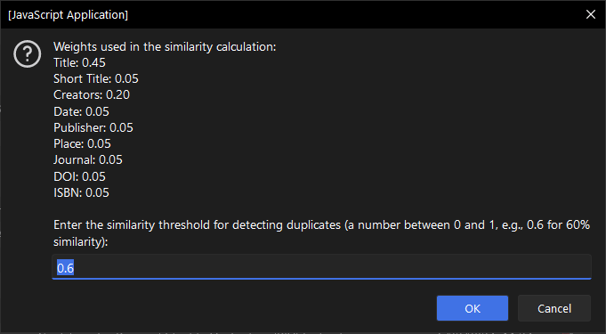
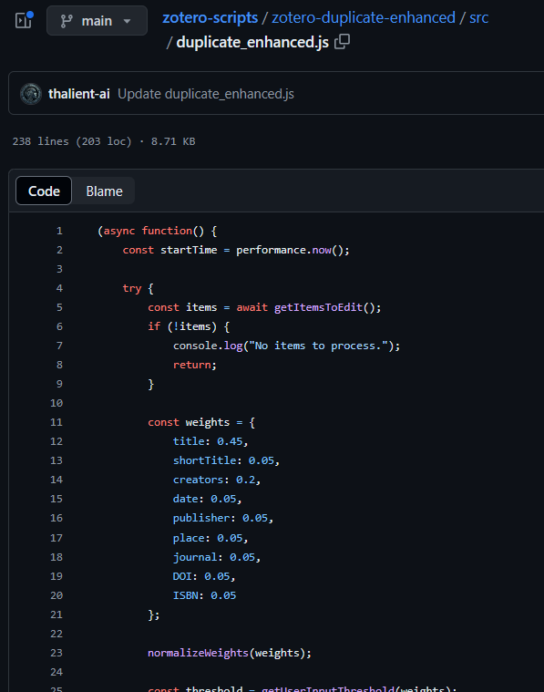
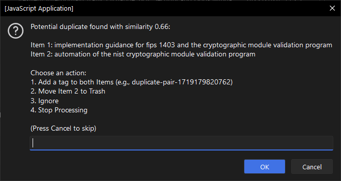
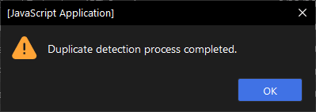
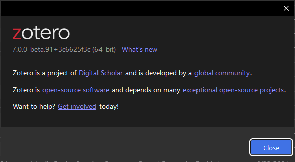

# Duplicate Enhanced Script

This script detects and handles duplicate items in your Zotero library based on customizable similarity thresholds and weights.

## Features

- **Scope Selection**: Prompts the user to select the scope of items to process (selected items, items in the current collection, or items in a saved search).
- **Customizable Weights**: Allows the user to set weights for different metadata fields used in the similarity calculation.
- **Similarity Threshold**: Prompts the user to set a similarity threshold for detecting duplicates.
- **Detailed Logging**: Logs the time taken for each operation and provides detailed error handling and messages.
- **User Actions**: Prompts the user to choose actions for detected duplicates (tagging, moving to trash, ignoring, or stopping processing).

## Usage

1. **Download the Script**: Download `duplicate_enhanced.js` from the repository.
2. **Open Zotero**: Launch the Zotero application.
3. **Run JavaScript**:
    - Go to `Tools > Developer > Run JavaScript`.
    - Copy and paste the content of `duplicate_enhanced.js` into the Zotero JavaScript console.
    - Press `Run`.

### Example

To detect and handle duplicates in selected items:

1. Select the items in Zotero.
2. Run the script.
3. Choose the option to process selected items.

4. Set the similarity threshold for detecting duplicates and review weights used for similarity calculation.

5. If you need to adjust the weights, edit the script here and re-run.

6. Handle detected duplicates by choosing actions (tagging, moving to trash, ignoring, or stopping processing).

## Detailed Script Description

The script performs the following steps:

1. **Initialization**: Logs the start time and sets up the Zotero pane.
2. **Scope Selection**: Prompts the user to select the scope of items to process.
    - Options: Selected items, items in the current collection, or items in a saved search.
3. **Retrieve Items**: Retrieves items based on the user’s selection.
4. **Set Weights**: Allows the user to set weights for different metadata fields used in the similarity calculation.
5. **Similarity Threshold**: Prompts the user to set a similarity threshold for detecting duplicates.
6. **Duplicate Detection**:
    - Normalizes item fields.
    - Calculates similarity between items using Jaccard similarity for each field.
    - Detects potential duplicates based on the similarity threshold.
7. **User Actions**: Prompts the user to choose actions for detected duplicates (tagging, moving to trash, ignoring, or stopping processing).
8. **Completion**: Logs completion time and alerts the user that the duplicate detection process is complete.

## How the Script Calculates Similarity

The script compares items based on the following fields:
- Title
- Short Title
- Creators
- Date
- Publisher
- Place
- Journal
- DOI
- ISBN
- Item Type

Each field is given a weight to determine its importance in the similarity calculation. By default, the weights are set as follows:

- Title: 0.40
- Short Title: 0.05
- Creators: 0.2
- Date: 0.05
- Publisher: 0.05
- Place: 0.05
- Journal: 0.05
- DOI: 0.05
- ISBN: 0.05
- Item Type: 0.05

These weights can be adjusted to meet your needs. The script normalizes these weights to ensure they sum to 1. The similarity is calculated using the Jaccard similarity index, which compares the overlap between the fields of two items. The combined similarity score is then used to identify potential duplicates.

## Functions Overview

- `logTime(label, time)`: Logs the time taken for each operation.
- `normalizeWeights(weights)`: Normalizes the weights for different metadata fields.
- `getUserInputThreshold(weights)`: Prompts the user to set the similarity threshold.
- `detectPotentialDuplicatesOptimized(items, threshold, weights)`: Detects potential duplicates based on the similarity threshold and weights.
- `normalizeItemFields(item, weights)`: Normalizes the fields of an item.
- `normalizeField(field)`: Normalizes a single field.
- `normalizeCreators(creators)`: Normalizes the creators' field.
- `calculateSimilarity(item1, item2, weights)`: Calculates the similarity between two items.
- `jaccardSimilarity(str1, str2)`: Calculates the Jaccard similarity between two strings.
- `handleDetectedDuplicates(duplicates)`: Handles detected duplicates based on user actions.
- `getItemsToEdit()`: Retrieves items based on the user's scope selection.

## Compatibility
All scripts were written for Zotero 7

## Contributing

Contributions are welcome! Please feel free to submit a Pull Request or open an issue if you have any suggestions or find any bugs.

## License

This project is licensed under the GPL-3.0 License - see the [LICENSE](LICENSE) file for details.
